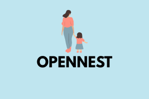

<p align="center">
  
</p>
[](LICENSE)
---

<p align="center">
  <h1>🪺 OpenNest</h1>
  <em>Your Family’s Digital Safe Haven</em>
</p>

<p align="center">
  OpenNest is an open‑source, self‑hosted parental control and digital safety platform.  
  Transparent, customizable, and built for modern families.
</p>

---

## ✨ Features

- 🛡️ **Protection** — Block unsafe websites and apps at the network level.  
- 📊 **Insights** — Real‑time dashboards with activity trends and alerts.  
- ⚙️ **Customization** — Modular plugins for screen time, safe search, and keyword monitoring.  
- 🌐 **Open Source** — Transparent, community‑driven, privacy‑respecting design.  
- 🎮 **Fun Factor** — Gamified dashboards and kid‑friendly companion apps.  

---

## 🚀 Getting Started

1. **Clone the repo**  
   ```bash
   git clone https://github.com/yourusername/opennest.git
   cd opennest
